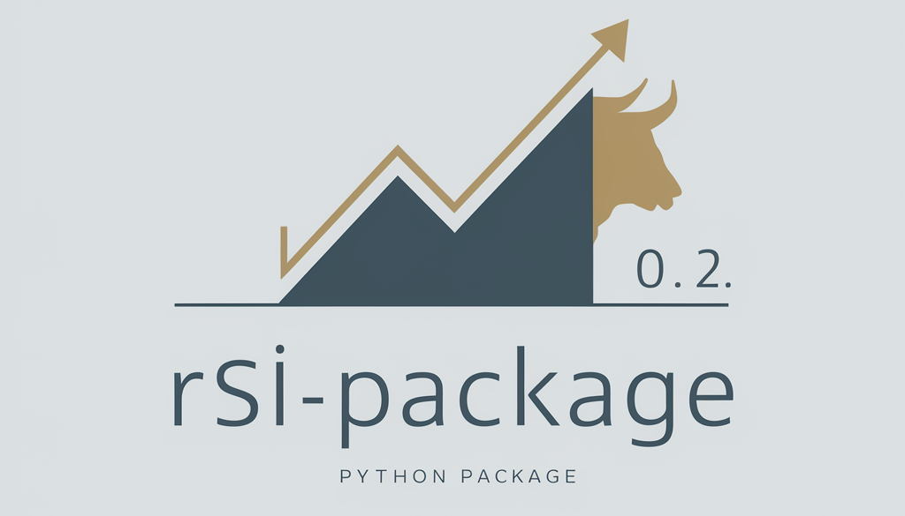
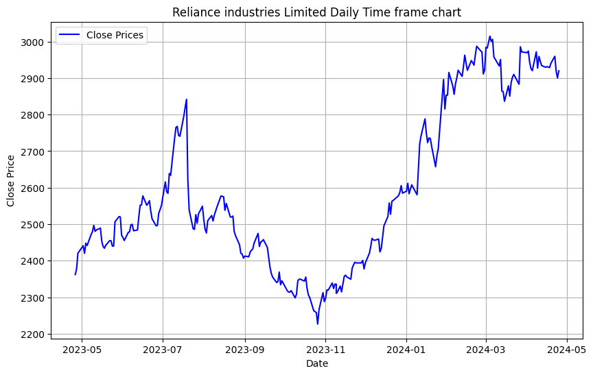
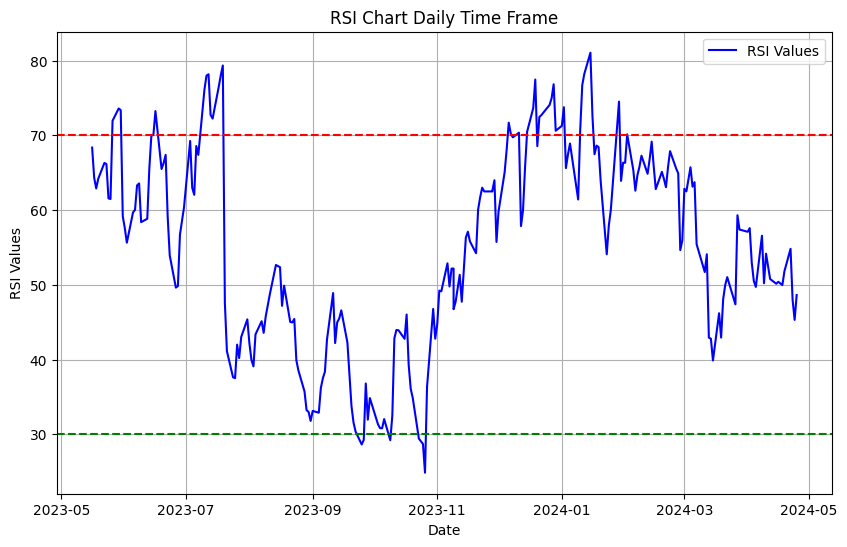
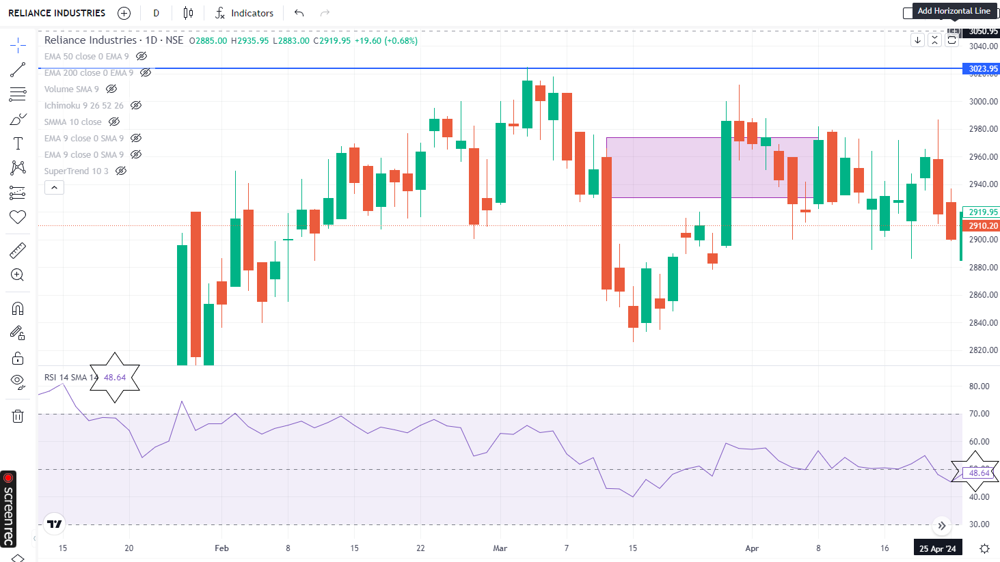

# Working with stock market data ?
# Wondering how to calculate Relative strength index values that matches exactly the same with your broker accounts?
# welcome to rsi package 0.2 
([click here for Pypi Link](https://pypi.org/project/rsi-package/))

## Why
This Python package provides an accurate calculation of the Relative Strength Index (RSI) using rolling averages. Unlike many existing packages that use simple 14-day averages, this package implements a rolling average formula that produces RSI values that closely match those seen in broker accounts and platforms like TradingView.

## Implementation Details
### CSV File format required as shown in  below 

|date|close|
|----|-----|
|29-01-2024	|2896.10
|30-01-2024	|2815.25
|31-01-2024	|2853.25
|01-02-2024	|2853.30
|02-02-2024	|2915.40

### Installation

#### You can install the RSI Calculator package using pip:
        pip install rsi-package

#### If you are using Google colab copy paste the below snippet[After installing the pip Given above] and then start from importin CSV as shown in next snippet
        import sys
        sys.path.append("/path/to/rsi_package-0.2")
        from rsi_calculator.rsi_calculator import calculate_rsi

#### Copy and paste the following code 
    import pandas as pd
    from rsi_package.rsi_calculator.rsi_calculator import calculate_rsi

    # Load your data into a pandas DataFrame (replace 'your_data.csv' with your actual data file)
    df = pd.read_csv("yourfile.csv")

    # Calculate RSI
    rsi_values = calculate_rsi(df)

    # Add RSI values as a new column to the DataFrame
    df['RSI'] = rsi_values
    # Drop unnecessary columns
    df = df[['date', 'close', 'RSI']]
    # Display the DataFrame with RSI values
    print(df.tail())

#### if you wish to plot the data by closing prices copy paste the following code
    import matplotlib.pyplot as plt

    # Assuming your DataFrame is named df
    # Convert the 'date' column to datetime objects
    df['date'] = pd.to_datetime(df['date'], dayfirst=True)

    # Plot the data
    plt.figure(figsize=(10, 6))
    plt.plot(df['date'], df['close'], label='Close Prices', color='blue')
    plt.xlabel('Date')
    plt.ylabel('Close Price')
    plt.title('Reliance industries Limited Daily Time frame chart') # change according to your data 
    plt.legend()
    plt.grid(True)
    plt.show()

#### if you wish to plot the data by RSI Values copy paste the following code
    import matplotlib.pyplot as plt

    # Assuming your DataFrame is named df
    # Convert the 'date' column to datetime objects
    df['date'] = pd.to_datetime(df['date'], dayfirst=True)

    # Plot the data
    plt.figure(figsize=(10, 6))
    plt.plot(df['date'], df['RSI'], label='RSI Values', color='blue')
    plt.xlabel('Date')
    plt.ylabel('RSI Values')
    plt.title('RSI Chart of Reliance industries limited Daily Time Frame')
    plt.legend()
    plt.grid(True)

    # Add horizontal lines at RSI levels of 70 and 30
    plt.axhline(y=70, color='red', linestyle='--', label='Overbought (70)')
    plt.axhline(y=30, color='green', linestyle='--', label='Oversold (30)')

    plt.show()

## Dataset Details 

- For indian stock market You can download any stock data from NSE Website ([using this Link](https://www.nseindia.com/report-detail/eq_security))

- for example i chose to download "Reliance Industries Limited" data for one year (it is advised to use data atleast larger than 6 months for best results, you can download the same file from this repo.)

## Evaluation and Results

- the table below shows the value of RSI for the corresponding dates from the "Reliance Industries Limited" data using the rsi_package
          
|date      |   close  | RSI   |
|----------|----------|-------|
|19-04-2024|  2940.25 | 51.82 |
|22-04-2024|  2959.70 |54.82  |
|23-04-2024|  2918.65 |48.01  |
|24-04-2024|  2900.35 | 45.31 |
|25-04-2024|  2919.95 | 48.64 |

- plot by close prices

- plot by RSI Values 

- As you can see in the snapshot below, the RSI Values do match with renowned platforms!

## Libraries 

**Language:** Python

**Packages:** , Pandas, rsi-package

## Contact

If you have any feedback/are interested in collaborating, please reach out to me at  &nbsp; <a href="mailto:kvsvyas@gmail.com"> 

## License

[MIT](https://choosealicense.com/licenses/mit/)

